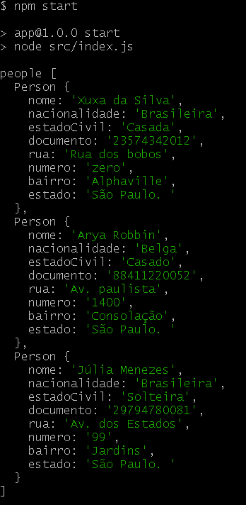
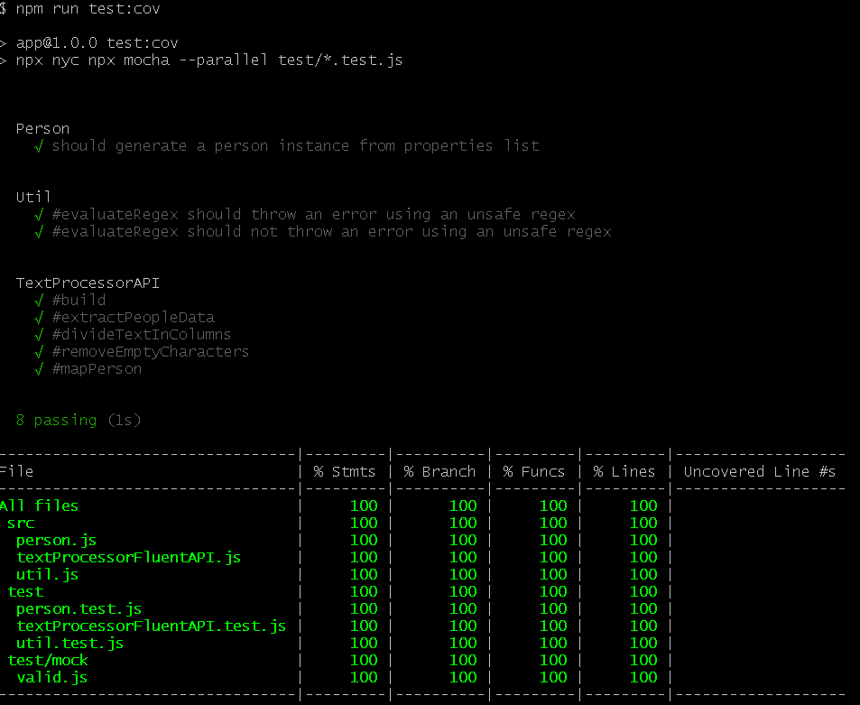

# Expressões Regulares - RegExp

Este repositório contém exemplos práticos e testes automatizados sobre conceitos avançados do JavaScript, incluindo expressões regulares no VSCode e terminal, e projetos de processamento de texto usando Fluent API para extração de dados de PDFs. Os exemplos são inspirados na Formação JavaScript Expert da EW Academy.

O objetivo é demonstrar o uso e comportamento dessas estruturas avançadas, promovendo um entendimento profundo para aplicações modernas e robustas em JavaScript.

## Conceitos Chave

### Expressões Regulares no VSCode e Terminal
Exploração do uso de regex para busca e substituição em editores e terminais, incluindo padrões para formatação de CPF, conversão de texto para JSON e links Markdown para HTML.

### Processamento de Texto com Fluent API
Implementação de uma API fluente para processamento de texto, focada na extração de dados de PDFs, incluindo divisão de texto, remoção de caracteres vazios e mapeamento de pessoas.

### Extração de Dados de PDF
Uso de bibliotecas como pdf-parse para ler e processar conteúdo de arquivos PDF, convertendo texto em estruturas de dados utilizáveis.

### Testes Automatizados
Demonstração de testes unitários e de cobertura usando Mocha, Chai e NYC, com foco em validação de funcionalidades de processamento de texto.

## Como Executar

### Pré-requisitos

- Node.js instalado (recomenda-se usar a versão 14.3 ou superior)
- Gerenciador de versões como NVM é recomendado

### Passos para Executar

1. Navegue até a pasta do módulo: `cd modulo05`
2. Para a aula de regex, consulte os arquivos `regex-vscode.md` e `regex-terminal.sh` na pasta `aula01-vscode-terminal-regex`
3. Para os projetos, navegue até as pastas correspondentes:
   - `cd aula02-projeto01/app` ou `cd aula03-projeto01/app` ou `cd aula04-projeto01/app`
4. Instale as dependências: `npm install`
5. Execute os scripts conforme necessário:
   - `npm start` para executar o projeto principal
   - `npm test` para rodar os testes
   - `npm run test:cov` para testes com cobertura
6. Para outras aulas, execute os arquivos `.js` correspondentes nas pastas `src`

## Imagens de Teste

Aqui estão algumas imagens relacionadas aos testes e cobertura:

## Observações

Este módulo aprofunda conceitos práticos do JavaScript que são essenciais para desenvolvimento moderno, incluindo manipulação de texto, expressões regulares e processamento de documentos. Dominar esses tópicos é fundamental para construir aplicações robustas e eficientes.

## Referências

- [MDN Web Docs - Regular Expressions](https://developer.mozilla.org/en-US/docs/Web/JavaScript/Guide/Regular_Expressions)
- [Regex101](https://regex101.com/)
- [pdf-parse](https://www.npmjs.com/package/pdf-parse)
- [Mocha - Testing Framework](https://mochajs.org/)
- [Chai - Assertion Library](https://www.chaijs.com/)
- [NYC - Code Coverage](https://github.com/istanbuljs/nyc)

## Autor

- **[immaioli](https://github.com/immaioli)** - Irineu Marcelo Maioli

## Licença

Este projeto está sob a Licença [MIT](https://opensource.org/license/MIT).
